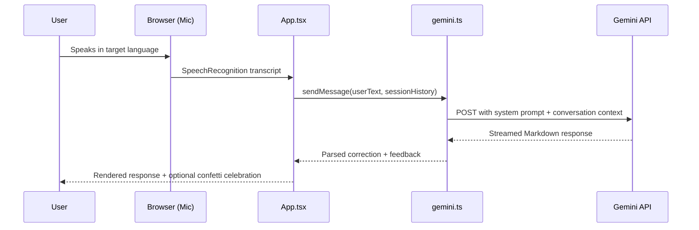

# LinguAI 🗣️

> **Real-time conversational AI partner for language practice — voice-first, context-aware, and shipped in under a day.**

[](https://ai.studio/apps/d74df480-b57d-4c60-a823-b02d8ca14236?fullscreenApplet=true)
[](https://ai.google.dev/)
[](https://react.dev/)
[](https://www.typescriptlang.org/)
[](https://vitejs.dev/)
[](https://tailwindcss.com/)
[](https://cloud.google.com/run)

---

## 🚀 Overview

Language learners plateau when they lack a safe, always-available conversation partner who corrects mistakes in real time. LinguAI solves this by delivering a **voice-first AI tutor** powered by Google Gemini — listening to spoken input, understanding conversational context across the session, and responding with corrections, hints, and encouragement across multiple target languages.

Architected, prompted, and deployed **in under 8 hours** using Google AI Studio and vibe-coding techniques — validating that a PM with prompt engineering skills can ship production-grade AI tooling without traditional engineering sprints.

---

## 📋 Table of Contents

- [Key Features](#-key-features)
- [Why LinguAI](#-why-linguai)
- [Tech Stack](#-tech-stack)
- [Project Layout](#-project-layout)
- [NLP & AI Routing](#-nlp--ai-routing)
- [Getting Started](#-getting-started)
- [Built with AI: Vibe-Coding Playbook](#-built-with-ai-vibe-coding-playbook)
- [Known Limitations](#-known-limitations)
- [Contributing](#-contributing)
- [Author](#author)

---

## ⚙️ Key Features

- **Enables real-time voice conversation** — captures microphone input, streams it to Gemini, and returns spoken-language AI responses end-to-end without page reloads
- **Maintains conversational context** — retains session memory so the AI tutor builds on prior exchanges, tracks recurring errors, and escalates difficulty progressively
- **Supports multi-language practice** — routes prompts through language-specific system instructions, adapting vocabulary, grammar correction style, and cultural nuance per target language
- **Delivers gamified feedback** — triggers animated confetti celebrations and contextual encouragement to reinforce positive learning moments and sustain engagement
- **Renders rich AI responses** — parses Markdown from Gemini output to display formatted corrections, example sentences, and structured explanations inline
- **Deploys zero-infrastructure** — runs as a containerized applet on Google Cloud Run, requiring only a Gemini API key to go from local dev to production URL

---

## 🌍 Why LinguAI

| Audience | Use case |
|---|---|
| **Language learners** | Practice speaking any target language with an infinitely patient AI tutor, 24/7 |
| **Students** | Demonstrate prompt engineering and AI product skills in a portfolio-ready, deployed app |
| **Travelers** | Build real-world conversational confidence before an international trip |
| **PMs & Builders** | Fork, remix, and extend — the codebase is a clean reference for Gemini-powered voice apps |
| **Educators** | Assign as a self-paced speaking exercise tool for remote language courses |

---

## 🛠 Tech Stack

### Frontend


### AI / ML


### Backend & Infra


### Tooling


---

## 🗺️ Project Layout

<details>
<summary>Expand file tree</summary>

```
LinguAI/
├── src/
│   ├── lib/
│   │   └── utils.ts          # Shared helpers — clsx/tailwind-merge for conditional class composition
│   ├── services/
│   │   └── gemini.ts         # Gemini API client — system prompt config, chat session init, streaming handler
│   ├── App.tsx               # Root component — voice loop orchestration, session state, UI rendering (483 lines)
│   ├── index.css             # Global styles + Tailwind v4 directives
│   ├── main.tsx              # React 19 entry point — mounts <App /> to #root
│   └── types.ts              # Shared TypeScript types: Message, Language, SessionState, etc.
├── index.html                # Vite HTML shell — sets viewport, loads /src/main.tsx
├── metadata.json             # AI Studio app manifest — declares microphone permission
├── .env.example              # Environment variable template
├── vite.config.ts            # Vite + @tailwindcss/vite plugin config
├── tsconfig.json             # TypeScript strict config
└── package.json              # Dependencies, scripts (dev / build / lint / preview)
```

</details>

---

## 🧠 NLP & AI Routing

LinguAI routes all conversational intelligence through the **Google Gemini API** (`@google/genai`). The service layer in `src/services/gemini.ts` handles model config, session lifecycle, and prompt design.



### Prompt Architecture

| Layer | Role |
|---|---|
| **System prompt** | Sets the AI persona as a patient, encouraging language tutor; specifies correction style, target language, and CEFR level tone |
| **Session context** | Appends full conversation history on each turn — enabling contextual recall and progressive difficulty |
| **User turn** | Passes raw transcribed speech as the human message |
| **Response parsing** | `react-markdown` renders the AI's structured output (corrections, examples, encouragement) as rich UI |

**Model:** Gemini Flash (latest stable via `@google/genai` auto-routing)
**Fallback:** Graceful error state rendered in UI if API call fails or mic access is denied

---

## 🏁 Getting Started

### Prerequisites

- Node.js ≥ 18
- A [Google Gemini API key](https://aistudio.google.com/app/apikey) (free tier available)

### Install

```bash
git clone https://github.com/yatinbhalla/LinguAI.git
cd LinguAI
npm install
```

### Configure environment

```bash
cp .env.example .env.local
```

<details>
<summary>Environment variables</summary>

```env
# Required — your Gemini API key from Google AI Studio
GEMINI_API_KEY="your_gemini_api_key_here"

# Optional — set automatically by AI Studio on Cloud Run
APP_URL="http://localhost:3000"
```

</details>

### Run locally

```bash
npm run dev
# → App running at http://localhost:3000
```

### Build for production

```bash
npm run build
npm run preview
```

> **Deploying to AI Studio:** Push to GitHub and connect your repo in [Google AI Studio](https://aistudio.google.com). AI Studio injects `GEMINI_API_KEY` automatically from Secrets and deploys to Cloud Run with a shareable public URL.

---

## 🧠 Built with AI: Vibe-Coding Playbook

> **For students and builders:** this section documents *exactly* how LinguAI was designed and shipped in under 8 hours using prompt engineering + Google AI Studio — no traditional sprint, no boilerplate writing.

### The Mental Model

Vibe-coding is not "let AI write random code and hope it works." It's **structured prompting with a clear product vision**. The formula:

1. **Define the core user action first** — what does the user *do* in one sentence?
2. **Prompt for skeleton, not perfection** — get something running, then layer features
3. **Iterate in capabilities, not files** — one feature per prompt session; don't build everything at once
4. **Name your constraints explicitly** — tell the AI which stack, which API version, which library
5. **Test live, not mentally** — run the app after every major prompt, catch regressions early

---

### Example Prompts That Built LinguAI

**Prompt 1 — The product spec (always start here):**
```
Build a React 19 + TypeScript + Vite + Tailwind CSS v4 app.
The app is a real-time language learning partner. The user speaks in their target language,
the AI (Google Gemini) responds with corrections, encouragement, and example sentences.
Use @google/genai for all Gemini calls. Keep state in React hooks. Use Framer Motion for transitions.
Start with a single-page layout: language selector, conversation thread, and a mic button.
```

---

**Prompt 2 — Adding voice input:**
```
Add microphone support using the Web Speech API (SpeechRecognition).
When the user presses the mic button, start recording. On silence, stop and send the transcript
to Gemini as the user's message. Show a visual pulse animation while recording.
Handle browser permission errors gracefully with an inline error message.
```

---

**Prompt 3 — Making the AI contextual:**
```
Update the Gemini service to maintain a conversation history array across turns.
Pass the full history as context on every API call so the AI remembers previous corrections.
The system prompt should instruct Gemini to: act as a patient language tutor,
always respond in the user's target language first, then explain corrections in English below.
```

---

**Prompt 4 — Gamified feedback:**
```
Add a confetti celebration (use the canvas-confetti npm package) when the AI response
signals the user spoke correctly. Parse the Gemini response for positive signals like
"excellent", "perfect", "well done", "great job". Trigger confetti only then — not every message.
```

---

**Prompt 5 — Multi-language routing:**
```
Add a language selector dropdown (Spanish, French, Japanese, German, Hindi, Mandarin).
When the user selects a language, update the Gemini system prompt to tune correction style,
script (e.g., Kanji for Japanese), and cultural nuance for that language.
Reset conversation history when the language changes.
```

---

### What This Proves

Building LinguAI demonstrated that a PM with prompt engineering skills can:
- **Architect** a full-stack voice AI app without writing boilerplate from scratch
- **Iterate** on product decisions (language routing, gamification triggers) in hours, not sprints
- **Ship** a production-grade, publicly accessible app using only a Gemini API key and an afternoon

> The best way to learn to vibe-code is to **fork this repo and work through Prompt 1 → 5 yourself**, changing one variable at a time to understand how each prompt shapes the output.

---

## ⚠️ Known Limitations

- **Browser speech recognition varies** — Chrome performs best; Safari and Firefox have inconsistent Web Speech API support
- **No persistent sessions** — conversation history resets on page refresh; no login or save-session feature yet
- **Single-model routing** — all requests route to Gemini Flash; no graceful fallback if API quota is exceeded
- **No formal level assessment** — difficulty adapts by session context, not an explicit CEFR level selector
- **Cold start latency** — Cloud Run containers may take ~2–3 seconds to warm on first load

### v2 Roadmap Ideas

- Persistent sessions with optional account login
- CEFR level selector (A1 → C2) to calibrate difficulty from session start
- Pronunciation scoring via audio waveform analysis
- Per-word correction highlighting in the transcript view

---

## 🤝 Contributing

LinguAI is a learning project built in the open — fork it, break it, extend it.

If you're working through the vibe-coding playbook above, open an Issue with your modified prompts and what they built. I'd love to see the variations.

**Ways to contribute:**
- **Feature PRs** — pick any v2 idea and ship it; label your PR with the prompt you used to scaffold it
- **Prompt improvements** — better system prompts that improve correction quality are always welcome
- **Bug reports** — especially browser-specific mic issues; include OS + browser version
- **Language validation** — native speakers who want to verify AI correction quality for a specific language: open a Discussion

→ [Open an Issue](https://github.com/yatinbhalla/LinguAI/issues) &nbsp;·&nbsp; [Start a Discussion](https://github.com/yatinbhalla/LinguAI/discussions)

---

## Author

Yatin Bhalla · Product Manager & AI Product Builder

[](https://linkedin.com/in/yatinbhalla42)
[](mailto:yatinbhalla42@gmail.com)
[](https://x.com/yatinbhalla42)
